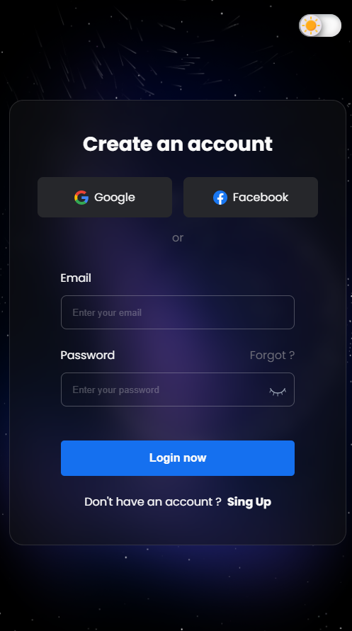

<h1 align="center">Página de Login Personalizada</h1>

    

        
        
        <!--  -->
    

---

---

Este é um projeto de página de login personalizada com funcionalidades avançadas, como exibição/ocultação de senha e alternância de temas claro/escuro.

## Funcionalidades

- **Exibição/Ocultação da Senha**: Os usuários podem alternar entre a exibição e a ocultação da senha ao clicar no ícone apropriado.
- **Alternância de Tema Claro/Escuro**: Os usuários podem alternar entre os temas claro e escuro da página de login com um simples clique no botão de alternância.

## Tecnologias Utilizadas

- HTML
- CSS
- JavaScript

## Como Utilizar

1. Clone o repositório: `git clone https://github.com/DevGabriel0402/Tela-de-Login.git`
2. Abra o arquivo `index.html` em seu navegador.

## Contribuição

Contribuições são bem-vindas! Para sugestões de melhorias, abra uma issue. Se deseja contribuir diretamente, siga estas etapas:

1. Fork o projeto
2. Crie uma nova branch (`git checkout -b feature/sua-feature`)
3. Faça commit de suas alterações (`git commit -am 'Adicione sua feature'`)
4. Faça push para a branch (`git push origin feature/sua-feature`)
5. Abra um Pull Request

## Licença

Este projeto está licenciado sob a Licença MIT - veja o arquivo [LICENSE](LICENSE) para detalhes.
